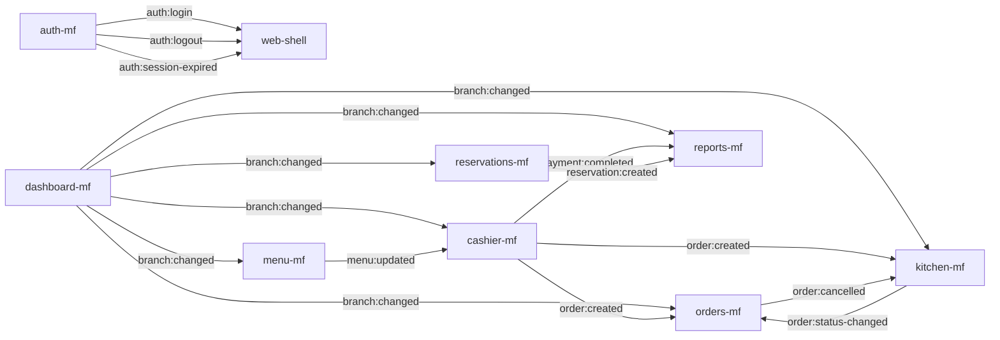

# AuraRest Multitenant

**Plataforma SaaS de administración multitenant para restaurantes** con arquitectura SOFEA (Service Oriented Front-End Architecture) y Microfrontends via Module Federation.

## Estado del proyecto

| Atributo | Valor |
|:---------|:------|
| **Rama analizada** | `micro-frontend` |
| **Estado** | En desarrollo activo |
| **Arquitectura** | Monorepo con pnpm workspaces + Module Federation (Vite 6 + Next.js 16) |
| **Último commit** | `d65b639` — feat: update development setup and enhance error diagnostics for microfrontends |
| **Backend** | Scaffolding inicial (NestJS 11 — solo Hello World) |

## Objetivo de la rama

La rama `micro-frontend` implementa la migración de una aplicación monolítica (`mfe-admin`) hacia una arquitectura de microfrontends donde cada dominio de negocio es una aplicación Vite independiente que se integra en tiempo de ejecución via Module Federation en un shell de Next.js.

**Funcionalidades que introduce:**

- 8 microfrontends independientes con configuración Module Federation.
- Shell orquestador (Next.js con `output: "export"`) como aplicación estática.
- Sistema de diseño unificado (`@maison/ui`) con tema oscuro/claro.
- Bus de eventos tipado (`@maison/event-bus`) para comunicación entre MFEs.
- Cliente de autenticación compartido (`@maison/auth-client`) con JWT.
- 5 paquetes compartidos de tipado, utilidades y componentes.

**Problema que resuelve:** Desacoplar dominios de negocio para permitir desarrollo, despliegue y escalado independiente, reemplazando el monolito `mfe-admin`.

**Estado actual del desarrollo:**

| Aspecto | Estado |
|:--------|:-------|
| Shell (web-shell) | Completo — rutas, layout, navegación, RemoteLoader |
| auth-mf | Completo — login, logout, forgot-password |
| dashboard-mf | Completo — dashboard, sucursales, usuarios, settings |
| menu-mf | Completo — menús, categorías, inventario |
| orders-mf | Completo — listado, filtros, métricas |
| kitchen-mf | Completo — KDS con WebSocket + polling |
| cashier-mf | Completo — POS con carrito, órdenes, pagos |
| reports-mf | Parcial — páginas placeholder (sin datos reales) |
| reservations-mf | Completo — listado, filtros, métricas, cancelación |
| Backend (NestJS) | Scaffolding inicial — sin endpoints reales |
| mfe-admin (legacy) | En migración — se eliminará al final |

## Arquitectura

### Tipo de arquitectura

- **Monorepo** con pnpm workspaces.
- **Microfrontends en tiempo de ejecución** via Module Federation.
- **Shell como host** (Next.js 16) que carga remotos (Vite 6) dinámicamente.
- **8 microfrontends remotos** que exponen su `App.tsx` via `remoteEntry.js`.
- **5 paquetes compartidos** (`@maison/*`) consumidos como workspace packages.
- **Backend independiente** (NestJS 11) fuera del workspace pnpm.
- **Comunicación entre MFEs** mediante `CustomEvent` en el `window` global tipado.
- **Autenticación** basada en JWT almacenado en `localStorage`, compartido via `@maison/auth-client`.
- **Estado global mínimo** — cada MFE mantiene su estado local en custom hooks.

### Diagrama de arquitectura

```mermaid
flowchart TD
    Usuario[Usuario Navegador] --> Shell[Aplicación Shell<br/>Next.js 16 · :3030]
    
    subgraph Shell_Interno[web-shell]
        Federation[Módulo Federation Runtime]
        AuthGuard[AuthGuard<br/>Protección de rutas]
        RemoteLoader[RemoteLoader<br/>Carga dinámica]
        BranchCtx[BranchContext<br/>Sucursal activa]
        ThemeCtx[ThemeContext<br/>Oscuro/Claro]
    end
    
    Shell --> RemoteLoader
    
    subgraph MFEs[Microfrontends Remotos · Vite 6]
        Auth[auth-mf<br/>:5001]
        Dashboard[dashboard-mf<br/>:5002]
        Menu[menu-mf<br/>:5003]
        Orders[orders-mf<br/>:5004]
        Kitchen[kitchen-mf<br/>:5005]
        Cashier[cashier-mf<br/>:5006]
        Reports[reports-mf<br/>:5007]
        Reservations[reservations-mf<br/>:5008]
    end
    
    RemoteLoader --> Auth
    RemoteLoader --> Dashboard
    RemoteLoader --> Menu
    RemoteLoader --> Orders
    RemoteLoader --> Kitchen
    RemoteLoader --> Cashier
    RemoteLoader --> Reports
    RemoteLoader --> Reservations
    
    subgraph Shared[Paquetes Compartidos]
        Types[@maison/types]
        API[@maison/api-client]
        UI[@maison/ui]
        Events[@maison/event-bus]
        AuthClient[@maison/auth-client]
    end
    
    Auth & Dashboard & Menu & Orders & Kitchen & Cashier & Reports & Reservations --> Types
    Auth & Dashboard & Menu & Orders & Kitchen & Cashier & Reports & Reservations --> API
    Auth & Dashboard & Menu & Orders & Kitchen & Cashier & Reports & Reservations --> UI
    Auth & Dashboard & Menu & Orders & Kitchen & Cashier & Reports & Reservations --> Events
    Auth & Dashboard & Menu & Orders & Kitchen & Cashier & Reports & Reservations --> AuthClient
    
    API --> Backend[NestJS Backend<br/>:4000/api/v1]
    
    subgraph Comunicacion[Comunicación entre MFEs]
        EventBus[CustomEvent en window<br/>emit / on tipados]
        SharedToken[localStorage<br/>maison_access_token]
    end
    
    Cashier -- "emit('order:created')" --> EventBus
    Kitchen -- "emit('order:status-changed')" --> EventBus
    Dashboard -- "emit('branch:changed')" --> EventBus
    Menu -- "emit('menu:updated')" --> EventBus
    Auth -- "emit('auth:login')" --> EventBus
    
    EventBus --> Kitchen
    EventBus --> Orders
    EventBus --> Cashier
    EventBus --> Reports
    
    Kitchen -- "WebSocket (ws://...)" --> Backend
```

### Comunicación entre módulos

| Tipo | Mecanismo | detalle |
|:-----|:----------|:--------|
| Shell → MFE | Module Federation (`loadRemote`) | `RemoteLoader` carga `remoteEntry.js` y renderiza el `./App` expuesto |
| MFE → MFE | Event Bus (`@maison/event-bus`) | `emit('order:created')` → `on('order:created')` |
| MFE → Shell | Event Bus | `emit('auth:logout')` → `AuthGuard` redirige a login |
| Shell → MFE | Props no usadas (contexto) | Cada MFE tiene su propio `BranchContext` que escucha `branch:changed` |
| MFE → API | REST (`@maison/api-client`) | `apiClient.get/post/put/patch/delete` |
| Kitchen → API | WebSocket | Conexión WS con fallback a polling cada 30s |
| Shared Auth | `localStorage` | Todos los MFEs leen/escriben en `maison_access_token` |

### Diagrama de eventos (Event Bus)



## Estructura del repositorio

```
AuraRestMultitenant/
├── apps/
│   ├── backend/                API REST NestJS (:4000) — solo scaffolding
│   ├── web-shell/              Shell orquestador Next.js 16 (:3030)
│   ├── auth-mf/                Autenticación Vite 6 (:5001)
│   ├── dashboard-mf/           Dashboard central Vite 6 (:5002)
│   ├── menu-mf/                Menús e inventario Vite 6 (:5003)
│   ├── orders-mf/              Pedidos Vite 6 (:5004)
│   ├── kitchen-mf/             KDS Cocina Vite 6 (:5005)
│   ├── cashier-mf/             POS Caja Vite 6 (:5006)
│   ├── reports-mf/             Reportes Vite 6 (:5007)
│   ├── reservations-mf/        Reservaciones Vite 6 (:5008)
│   └── mfe-admin/              Legacy (monolito) — en migración
├── packages/
│   ├── types/                  @maison/types — tipos de dominio
│   ├── api-client/             @maison/api-client — cliente HTTP
│   ├── ui/                     @maison/ui — design system (StatCard, Skeleton, EmptyState, Icons)
│   ├── event-bus/              @maison/event-bus — emit/on tipados
│   └── auth-client/            @maison/auth-client — gestión de tokens JWT
├── docs/                       (vacío)
├── infra/                      (vacío)
├── scripts/                    (vacío)
├── .env.example                Variables de entorno de referencia
├── package.json                Scripts globales del monorepo
├── pnpm-workspace.yaml         Definición de workspaces
└── README.md                   Este archivo
```

## Microfrontends identificados

Se detectaron **8 microfrontends** (todos Vite 6 + Module Federation remotos) más **1 shell** (Next.js 16 host) y **1 aplicación legacy en migración** (`mfe-admin`). El backend (NestJS) no se considera microfrontend.

| Microfrontend | Ruta | Tipo | Puerto | Tecnología | Estado |
|:--------------|:-----|:-----|------:|:-----------|:-------|
| `auth-mf` | `apps/auth-mf` | Remote | 5001 | Vite 6 + React 19 | Completo |
| `dashboard-mf` | `apps/dashboard-mf` | Remote | 5002 | Vite 6 + React 19 | Completo |
| `menu-mf` | `apps/menu-mf` | Remote | 5003 | Vite 6 + React 19 | Completo |
| `orders-mf` | `apps/orders-mf` | Remote | 5004 | Vite 6 + React 19 | Completo |
| `kitchen-mf` | `apps/kitchen-mf` | Remote | 5005 | Vite 6 + React 19 | Completo |
| `cashier-mf` | `apps/cashier-mf` | Remote | 5006 | Vite 6 + React 19 | Completo |
| `reports-mf` | `apps/reports-mf` | Remote | 5007 | Vite 6 + React 19 | Parcial |
| `reservations-mf` | `apps/reservations-mf` | Remote | 5008 | Vite 6 + React 19 | Completo |
| `web-shell` | `apps/web-shell` | Host (Shell) | 3030 | Next.js 16 + React 19 | Completo |
| `mfe-admin` | `apps/mfe-admin` | Legacy/monolito | 5002* | Vite 6 + React 19 | En migración |

> \* `mfe-admin` comparte puerto 5002 con `dashboard-mf`, lo que indica que está siendo reemplazado progresivamente.

### Justificación técnica

Cada aplicación en `apps/` excepto `backend` y `mfe-admin` es un microfrontend porque:

1. **Configura Module Federation**: todas usan `@module-federation/vite` con `name`, `filename: 'remoteEntry.js'`, `exposes` y `shared`.
2. **Se cargan dinámicamente**: el shell las carga via `loadRemote()` en `RemoteLoader.tsx` (`apps/web-shell/src/components/shell/RemoteLoader.tsx:1`).
3. **Dominio de negocio único**: cada una cubre un dominio distinto (auth, dashboard, menús, pedidos, cocina, caja, reportes, reservaciones).
4. **Independencia**: cada una tiene su propio `vite.config.ts`, `package.json`, `tsconfig.json`, y puede ejecutarse en solitario.
5. **Comunicación acotada**: solo se comunican via event-bus, sin dependencias directas entre sí.

El **backend** (`apps/backend`) no es microfrontend — es una API REST NestJS independiente que sirve datos a todos los MFEs.

El **`mfe-admin`** es el monolito original que se está migrando a microfrontends. Contiene todas las funcionalidades de `dashboard-mf`, `menu-mf`, `orders-mf`, `reports-mf` y `reservations-mf` combinadas. El `pnpm-workspace.yaml` lo incluye explícitamente con el comentario *"se elimina al final (FASE 12)"*.

## Descripción de los microfrontends

### 1. auth-mf (Autenticación)

**Ubicación:** `apps/auth-mf`

**Responsabilidad:** Manejar el inicio de sesión, recuperación de contraseña y ciclo de vida de tokens JWT.

**Usuarios:** Todos los usuarios del sistema (super_admin, admin, manager, staff).

**Funcionalidades actuales:**
- Login con email y contraseña.
- Recuperación de contraseña (formulario).
- Almacenamiento de tokens en `localStorage`.
- Emisión de eventos `auth:login`, `auth:logout`.
- Redirección post-login vía callback.

**Funcionalidades pendientes:**
- Registro de nuevos usuarios.
- Confirmación de email.
- Autenticación 2FA.

**Dependencias:**
- API: `POST /api/v1/auth/login`, `POST /api/v1/auth/logout`, `POST /api/v1/auth/refresh`, `POST /api/v1/auth/forgot-password`, `POST /api/v1/auth/reset-password`
- Paquetes: `@maison/api-client`, `@maison/auth-client`, `@maison/event-bus`, `@maison/types`, `@maison/ui`

**Rutas principales:**

| Ruta | Descripción | Acceso |
|:-----|:------------|:-------|
| `/auth/login` | Inicio de sesión | Público |
| `/auth/forgot-password` | Recuperar contraseña | Público |

### 2. dashboard-mf (Dashboard central)

**Ubicación:** `apps/dashboard-mf`

**Responsabilidad:** Panel de administración principal con métricas globales, gestión de sucursales y usuarios.

**Usuarios:** Super admin, admin, manager.

**Funcionalidades actuales:**
- Dashboard con métricas (total sucursales, usuarios activos, ingresos, rating).
- Gráfico de ingresos por mes.
- Feed de actividad reciente.
- Tabla de sucursales/tenants.
- Gestión de sucursales (listado, filtros).
- Gestión de usuarios (listado, roles).
- Página de configuración.
- Selector de sucursal con emisión de evento `branch:changed`.

**Funcionalidades pendientes:**
- CRUD completo de sucursales (crear, editar, eliminar).
- CRUD completo de usuarios (invitar, editar rol, desactivar).
- Formularios de configuración funcionales.

**Dependencias:**
- API: `GET /api/v1/admin/dashboard/stats`, `GET /api/v1/admin/dashboard/revenue`, `GET /api/v1/admin/dashboard/activity`, `GET /api/v1/admin/branches/*`, `GET /api/v1/admin/users/*`, `GET /api/v1/admin/tenants/*`
- Paquetes: todos los `@maison/*`
- Suscribe a: `auth:login`, `auth:logout`

**Rutas principales:**

| Ruta | Descripción | Acceso |
|:-----|:------------|:-------|
| `/dashboard` | Panel principal | Autenticado |
| `/sucursales` | Gestión de sucursales | Admin+ |
| `/users` | Gestión de usuarios | Admin+ |
| `/settings` | Configuración | Admin+ |
| `/tenants` | Gestión de tenants (multitenant) | Super admin |

### 3. menu-mf (Menús e inventario)

**Ubicación:** `apps/menu-mf`

**Responsabilidad:** Gestión del catálogo de productos (menú), categorías e inventario.

**Usuarios:** Admin, manager, staff.

**Funcionalidades actuales:**
- Listado de productos del menú con tarjetas visuales.
- Filtros por estado (disponible, no disponible, sin stock).
- Búsqueda de productos.
- Métricas del menú (total, disponibles, no disponibles, sin stock, populares).
- Vista de categorías (pendiente de contenido).
- Vista de inventario (pendiente de contenido).
- Suscripción a cambios de sucursal.

**Funcionalidades pendientes:**
- CRUD completo de productos (crear, editar, eliminar).
- CRUD de categorías.
- Gestión de inventario (stock, proveedores).
- Subida de imágenes de productos.
- Vista de detalle de producto.

**Dependencias:**
- API: `GET /api/v1/admin/menus/*`, `GET /api/v1/admin/menus/stats`, `GET /api/v1/admin/categories/*`, `GET /api/v1/admin/inventory/*`
- Paquetes: todos los `@maison/*`
- Suscribe a: `branch:changed`

**Rutas principales:**

| Ruta | Descripción | Acceso |
|:-----|:------------|:-------|
| `/menus` | Catálogo de productos | Autenticado |
| `/categorias` | Gestión de categorías | Admin+ |
| `/inventario` | Control de inventario | Admin+ |

### 4. orders-mf (Pedidos)

**Ubicación:** `apps/orders-mf`

**Responsabilidad:** Monitor y gestión de pedidos en tiempo real.

**Usuarios:** Admin, manager, staff (meseros, cajeros).

**Funcionalidades actuales:**
- Listado de pedidos con tarjetas visuales.
- Estado en tiempo real con indicador "En vivo".
- Filtros por estado (todos, activos, pendientes, en prep., listos, entregados).
- Búsqueda por número de orden o cliente.
- Métricas del día (total, en preparación, completados, ingresos).

**Funcionalidades pendientes:**
- Cambio de estado de pedidos.
- Cancelación de pedidos.
- Detalle de pedido expandido.
- Notificaciones en tiempo real vía WebSocket (actualmente usa polling).

**Dependencias:**
- API: `GET /api/v1/admin/orders/*`, `GET /api/v1/admin/orders/stats`
- Paquetes: todos los `@maison/*`
- Suscribe a: `order:created`, `order:status-changed`, `branch:changed`

**Rutas principales:**

| Ruta | Descripción | Acceso |
|:-----|:------------|:-------|
| `/orders` | Monitor de pedidos | Autenticado |

### 5. kitchen-mf (KDS — Cocina)

**Ubicación:** `apps/kitchen-mf`

**Responsabilidad:** Kitchen Display System — cola de órdenes de cocina en tiempo real.

**Usuarios:** Personal de cocina.

**Funcionalidades actuales:**
- Columnas kanban: Nuevos | En preparación | Listos.
- Temporizador de elapsed time con alerta de overdue (>15 min).
- WebSocket para actualizaciones en tiempo real con fallback a polling cada 30s.
- Cambio de estado de tickets (new → in_progress → ready).
- Emisión de `order:status-changed` al cambiar estado.
- Suscripción a eventos `order:created`, `order:updated`, `branch:changed`.

**Funcionalidades pendientes:**
- Priorización de órdenes.
- Alertas sonoras para nuevos pedidos.
- Personalización de tiempos de alerta.
- Impresión de comandas.

**Dependencias:**
- API: `GET /api/v1/kitchen/queue`, `PATCH /api/v1/kitchen/tickets/:id/status`
- WebSocket: `ws://localhost:3001/kitchen/queue`
- Paquetes: todos los `@maison/*`
- Suscribe a: `order:created`, `order:updated`, `branch:changed`

**Rutas principales:**

| Ruta | Descripción | Acceso |
|:-----|:------------|:-------|
| `/kitchen` | KDS — Cola de cocina | Autenticado |

### 6. cashier-mf (POS — Caja)

**Ubicación:** `apps/cashier-mf`

**Responsabilidad:** Punto de venta — creación de órdenes, carrito y procesamiento de pagos.

**Usuarios:** Cajeros, meseros.

**Funcionalidades actuales:**
- Vista de selección de mesas con estado (libre, ocupada, reservada, mantenimiento).
- Catálogo de productos con búsqueda y filtro por categoría.
- Carrito lateral con cantidades y totales.
- Cálculo de IVA (16%).
- Creación de órdenes (dine_in / takeaway).
- Selección de método de pago (efectivo, tarjeta, QR).
- Procesamiento de pagos.
- Emisión de `order:created` y `payment:completed`.
- Suscripción a `branch:changed` y `menu:updated`.

**Funcionalidades pendientes:**
- División de cuentas.
- Propinas.
- Descuentos y promociones.
- Notas por item.
- Impresión de ticket.
- Múltiples métodos de pago por orden.

**Dependencias:**
- API: `GET /api/v1/admin/menus`, `GET /api/v1/cashier/tables`, `POST /api/v1/orders`, `POST /api/v1/payments`
- Paquetes: todos los `@maison/*`
- Suscribe a: `branch:changed`, `menu:updated`

**Rutas principales:**

| Ruta | Descripción | Acceso |
|:-----|:------------|:-------|
| `/cashier` | POS — Punto de venta | Autenticado |

### 7. reports-mf (Reportes)

**Ubicación:** `apps/reports-mf`

**Responsabilidad:** Reportes, analíticas, logs e integraciones.

**Usuarios:** Super admin, admin.

**Funcionalidades actuales:**
- Página de reportes (placeholder — muestra "Módulo en construcción").
- Página de analytics (placeholder).
- Página de logs (placeholder).
- Página de integraciones (placeholder).

**Funcionalidades pendientes:**
- Reportes de ventas con filtros (fecha, sucursal, período).
- Gráficos de analytics.
- Vista de logs del sistema.
- Gestión de integraciones (API keys, webhooks).
- Exportación de reportes (CSV, PDF).

**Dependencias:**
- API: `GET /api/v1/admin/reports/sales`, `GET /api/v1/admin/analytics`, `GET /api/v1/admin/logs`, `GET /api/v1/admin/reports/export`
- Paquetes: todos los `@maison/*`
- Suscribe a: `branch:changed`, `payment:completed`

**Rutas principales:**

| Ruta | Descripción | Acceso |
|:-----|:------------|:-------|
| `/reportes` | Reportes de ventas | Admin+ |
| `/analytics` | Analíticas | Admin+ |
| `/logs` | Registros del sistema | Super admin |
| `/integrations` | Integraciones | Super admin |

### 8. reservations-mf (Reservaciones)

**Ubicación:** `apps/reservations-mf`

**Responsabilidad:** Gestión de reservaciones de clientes.

**Usuarios:** Admin, manager, staff (host).

**Funcionalidades actuales:**
- Listado de reservaciones con filas detalladas.
- Filtros por estado (todas, pendientes, confirmadas, en mesa, completadas, canceladas).
- Búsqueda por huésped o código de confirmación.
- Métricas del día (total, pendientes, completadas, ocupación).
- Cancelación de reservaciones con emisión `reservation:cancelled`.
- Resumen del día con estadísticas.
- Mini calendario (placeholder).

**Funcionalidades pendientes:**
- Creación de reservaciones.
- Confirmación de reservaciones.
- Marcar llegada (arrived).
- Vista de calendario funcional.
- Asignación de mesas.
- Recordatorios automáticos.

**Dependencias:**
- API: `GET /api/v1/admin/reservations/*`, `GET /api/v1/admin/reservations/stats`, `POST/DELETE /api/v1/admin/reservations/*`
- Paquetes: todos los `@maison/*`
- Suscribe a: `branch:changed`

**Rutas principales:**

| Ruta | Descripción | Acceso |
|:-----|:------------|:-------|
| `/reservaciones` | Gestión de reservaciones | Autenticado |

## Tecnologías

| Tecnología | Versión | Uso |
|:-----------|--------:|:----|
| Next.js | 16.2.6 | Shell orquestador (SSG estático) |
| React | 19.2.4 | UI en todos los MFEs |
| Vite | 6.3 | Bundler de MFEs |
| TypeScript | 5 | Tipado estático |
| Tailwind CSS | 3.4 | Estilos utilitarios |
| NestJS | 11 | API REST backend |
| pnpm | ≥ 11.4 | Gestor de paquetes y workspaces |
| @module-federation/vite | 1.x | Plugin Module Federation para Vite |
| @module-federation/runtime | 2.x | Carga dinámica de remotos en Next.js |
| React Router DOM | 7.x | Routing interno de cada MFE |
| concurrently | 9.x | Ejecución paralela de procesos |

## Requisitos previos

- **Node.js** ≥ 18
- **pnpm** ≥ 11.4 (instalar con `npm install -g pnpm`)
- **npm** (para el backend, que no está en el workspace pnpm)

## Instalación

```bash
git clone <url-del-repositorio>
cd AuraRestMultitenant
pnpm install
```

> `pnpm install` instala las dependencias de todos los `apps/*` y `packages/*` del workspace definido en `pnpm-workspace.yaml`.

## Variables de entorno

Copiar desde `.env.example`:

```bash
cp .env.example .env.local
```

**Variables de entorno:**

```env
# API base URL para todos los MFEs (Vite)
VITE_API_URL=http://localhost:4000/api/v1

# URLs de cada MFE (sobrescribe defaults en federation.ts)
NEXT_PUBLIC_MFE_AUTH_URL=http://localhost:5001/remoteEntry.js
NEXT_PUBLIC_MFE_DASHBOARD_URL=http://localhost:5002/remoteEntry.js
NEXT_PUBLIC_MFE_MENU_URL=http://localhost:5003/remoteEntry.js
NEXT_PUBLIC_MFE_ORDERS_URL=http://localhost:5004/remoteEntry.js
NEXT_PUBLIC_MFE_KITCHEN_URL=http://localhost:5005/remoteEntry.js
NEXT_PUBLIC_MFE_CASHIER_URL=http://localhost:5006/remoteEntry.js
NEXT_PUBLIC_MFE_REPORTS_URL=http://localhost:5007/remoteEntry.js
NEXT_PUBLIC_MFE_RESERVATIONS_URL=http://localhost:5008/remoteEntry.js
```

Cada MFE necesita su propio `.env.local` con `VITE_API_URL`. No hay archivos `.env` reales en el repositorio (solo `.env.example`). Ver `apps/web-shell/src/lib/federation.ts:38-47` para defaults.

## Ejecución del proyecto

### Todo el proyecto en desarrollo

```bash
pnpm dev:all
```

Esto levanta el shell (Next.js :3030) y los 8 MFEs (Vite :5001-5008) en paralelo.

### Solo los microfrontends

```bash
pnpm dev:mfes
```

### Ejecutar una aplicación específica

```bash
pnpm dev:shell
pnpm dev:auth
pnpm dev:dashboard
pnpm dev:menu
pnpm dev:orders
pnpm dev:kitchen
pnpm dev:cashier
pnpm dev:reports
pnpm dev:reservations
```

### Backend (NestJS)

```bash
cd apps/backend
npm install
npm run start:dev
```

> El backend no está en el workspace pnpm porque sus dependencias no están en la store de pnpm (ver `pnpm-workspace.yaml`).

## Scripts disponibles

Desde la raíz del monorepo (`package.json`):

| Script | Descripción |
|:-------|:------------|
| `pnpm dev:all` | Shell + 8 MFEs en paralelo |
| `pnpm dev:mfes` | Solo 8 MFEs |
| `pnpm dev:shell` | Solo web-shell (:3030) |
| `pnpm dev:auth` | Solo auth-mf (:5001) |
| `pnpm dev:dashboard` | Solo dashboard-mf (:5002) |
| `pnpm dev:menu` | Solo menu-mf (:5003) |
| `pnpm dev:orders` | Solo orders-mf (:5004) |
| `pnpm dev:kitchen` | Solo kitchen-mf (:5005) |
| `pnpm dev:cashier` | Solo cashier-mf (:5006) |
| `pnpm dev:reports` | Solo reports-mf (:5007) |
| `pnpm dev:reservations` | Solo reservations-mf (:5008) |
| `pnpm build` | Build completo (MFEs + shell) |
| `pnpm build:mfes` | Build secuencial de los 8 MFEs |
| `pnpm build:shell` | Build del shell Next.js |
| `pnpm preview:all` | Preview de producción completo |
| `pnpm preview:mfes` | Preview de MFEs |
| `pnpm preview:shell` | Preview del shell via `npx serve` |

## Puertos

| Servicio | Puerto | Configuración |
|:---------|------:|:--------------|
| web-shell (Next.js) | 3030 | `apps/web-shell/package.json` → `"dev": "next dev -p 3030"` |
| auth-mf | 5001 | `apps/auth-mf/vite.config.ts` |
| dashboard-mf | 5002 | `apps/dashboard-mf/vite.config.ts` |
| menu-mf | 5003 | `apps/menu-mf/vite.config.ts` |
| orders-mf | 5004 | `apps/orders-mf/vite.config.ts` |
| kitchen-mf | 5005 | `apps/kitchen-mf/vite.config.ts` |
| cashier-mf | 5006 | `apps/cashier-mf/vite.config.ts` |
| reports-mf | 5007 | `apps/reports-mf/vite.config.ts` |
| reservations-mf | 5008 | `apps/reservations-mf/vite.config.ts` |
| mfe-admin (legacy) | 5002* | `apps/mfe-admin/vite.config.ts` — **comparte puerto con dashboard-mf** |
| Backend NestJS | 3000 (default) | `apps/backend/src/main.ts` → `process.env.PORT ?? 3000` |

> ⚠️ `mfe-admin` y `dashboard-mf` comparten el puerto 5002. Esto es un conflicto temporal durante la migración.

## Orden recomendado de desarrollo

| Etapa | Módulo | Motivo | Dependencias |
|------:|:-------|:-------|:-------------|
| 1 | Configuración del monorepo | Base necesaria para todo lo demás | Ninguna |
| 2 | Paquetes compartidos: `types`, `api-client`, `ui`, `event-bus`, `auth-client` | Todos los MFEs dependen de ellos | Monorepo configurado |
| 3 | Backend NestJS + API REST | Los MFEs consumen APIs que no existen | Ninguna |
| 4 | `web-shell` (shell) | Orquestador que carga los MFEs | Paquetes compartidos |
| 5 | `auth-mf` | Autenticación: requisito para todo el sistema | Paquetes compartidos, API auth |
| 6 | `dashboard-mf` | Panel central, sucursales, usuarios | API dashboard, auth |
| 7 | `menu-mf` | Catálogo de productos | API menús, categories, inventory |
| 8 | `cashier-mf` | POS — depende del menú para crear órdenes | Menu API, Orders API |
| 9 | `orders-mf` | Monitor de pedidos | API orders, eventos de cashier |
| 10 | `kitchen-mf` | KDS — recibe órdenes de cashier | API kitchen WS, eventos de orders |
| 11 | `reservations-mf` | Reservaciones | API reservations |
| 12 | `reports-mf` | Reportes y analíticas | APIs de todos los dominios + eventos |
| 13 | Eliminar `mfe-admin` (legacy) | Ya no es necesario | Todos los MFEs migrados |
| 14 | Pruebas de integración | Verificar comunicación entre MFEs | Todos los módulos |
| 15 | Despliegue | Configurar build y deploy independiente | Pruebas completadas |

## Dificultad estimada

| Microfrontend | Nivel | Puntuación | Motivo principal |
|:--------------|:------|:----------:|:-----------------|
| auth-mf | Baja | 3/10 | Funcionalidad simple (login/forgot), 2 páginas, API simple |
| dashboard-mf | Media | 5/10 | 4 páginas, múltiples APIs, gráficos, contexto de sucursal, roles |
| menu-mf | Media | 5/10 | 3 páginas, CRUD de productos y categorías, filtros, búsqueda |
| orders-mf | Media | 5/10 | 1 página compleja con filtros en tiempo real, eventos entrantes |
| kitchen-mf | Alta | 7/10 | WebSocket con fallback polling, temporizadores, eventos bidireccionales |
| cashier-mf | Alta | 8/10 | POS completo: carrito, mesas, pagos, IVA, eventos salientes, integración con menú |
| reports-mf | Media | 4/10 | Páginas placeholder, APIs por definir, exportación CSV/PDF |
| reservations-mf | Media | 6/10 | CRUD completo, calendario, filtros, cancelación, eventos |
| web-shell | Alta | 7/10 | Orquestador de MFEs, Module Federation runtime, AuthGuard, contexts globales, navegación |
| Backend (NestJS) | Muy alta | 9/10 | Toda la lógica de negocio, autenticación JWT, WebSockets, bases de datos, migraciones, autorización |

## Plan de implementación

### Fase 0: Diagnóstico y preparación (Completada)

**Objetivo:** Validar arquitectura, dependencias y configuración del monorepo.

**Tareas:**
- Configurar pnpm workspaces.
- Definir estructura de carpetas.
- Crear paquetes compartidos base.
- Configurar Module Federation en Vite y Next.js.
- Establecer puertos y variables de entorno.

**Riesgos:**
- Dependencias no sincronizadas entre paquetes.
- TypeScript errors por referencias cruzadas. (Ya se detectaron errores TYPE-001 en `.mf/diagnostics/latest.json`.)

**Entregables:**
- Monorepo funcional con pnpm.
- 5 paquetes compartidos.
- Pipeline de build para MFEs y shell.

### Fase 1: Arquitectura base (Completada)

**Objetivo:** Implementar el shell, navegación, autenticación y paquetes compartidos.

**Tareas:**
- Web-shell con Next.js y `output: 'export'`.
- Module Federation runtime con 8 remotes.
- Componentes de layout (AdminShell, AdminSidebar, AdminTopbar).
- AuthGuard para protección de rutas.
- RemoteLoader para carga dinámica.
- BranchContext para selección de sucursal.
- Sistema de temas oscuro/claro.
- auth-mf con login y forgot-password.

### Fase 2: Módulos compartidos (Completada)

**Objetivo:** Implementar componentes de UI, tipos y utilidades compartidas.

**Tareas:**
- `@maison/types`: Tipos de dominio completos.
- `@maison/ui`: StatCard, Skeleton, EmptyState, Icons, cn().
- `@maison/api-client`: Cliente HTTP con manejo de errores.
- `@maison/auth-client`: Gestión de tokens JWT.
- `@maison/event-bus`: Sistema de eventos tipados.

### Fase 3: Desarrollo funcional (En progreso)

**Objetivo:** Desarrollar los microfrontends de negocio.

**Completado:**
- dashboard-mf, menu-mf, orders-mf, kitchen-mf, cashier-mf, reservations-mf.

**Pendiente:**
- reports-mf (placeholders sin datos).
- Backend NestJS (solo scaffolding).

### Fase 4: Integración (Pendiente)

**Objetivo:** Conectar MFEs con APIs reales, validar navegación y permisos.

**Tareas:**
- Implementar backend NestJS con módulos reales.
- Conectar cada MFE a sus endpoints.
- Validar flujo completo autenticación → dashboard → órdenes → cocina → caja.
- Verificar eventos entre MFEs.

### Fase 5: Pruebas (Pendiente)

**Objetivo:** Validar cada aplicación individual e integrada.

**Tareas:**
- Pruebas unitarias en cada MFE.
- Pruebas de integración del event-bus.
- Pruebas de navegación entre MFEs.
- Pruebas de autenticación y autorización.

### Fase 6: Despliegue (Pendiente)

**Objetivo:** Preparar compilación y despliegue independiente.

**Tareas:**
- Configurar build de producción para cada MFE.
- Configurar static export del shell.
- Documentar estrategia de despliegue.

## Pruebas

Actualmente no hay comandos de prueba definidos en el monorepo. El único comando `test` en `package.json` raíz es:

```bash
pnpm test  # echo "Error: no test specified" && exit 1
```

El backend tiene Jest configurado:

```bash
cd apps/backend
npm run test
npm run test:e2e
```

**Tipos de pruebas recomendadas:**

- **Unitarias**: hooks, servicios, utilidades de cada MFE.
- **Integración**: comunicación event-bus entre MFEs.
- **End-to-end**: flujo completo login → crear orden → cocina → pago.
- **Contratos**: verificar que los tipos compartidos sean consistentes.
- **Navegación**: que RemoteLoader cargue correctamente cada MFE.
- **Autenticación**: login, token expiry, refresh, logout.

## Convenciones de desarrollo

- **Eventos:** formato `dominio:accion` en minúsculas (ej. `order:created`).
- **Tipos compartidos:** solo en `@maison/types`, nunca tipos locales entre MFEs.
- **Sin estado global entre MFEs:** cada MFE es una isla de estado.
- **Comunicación:** solo via `@maison/event-bus`.
- **Puertos fijos:** no cambiar sin actualizar `federation.ts`.
- **Servicios REST:** cada MFE tiene sus propios servicios, nunca compartidos.
- **SSR:** el shell usa `output: "export"` — todo corre en cliente. Los MFEs Vite son 100% client-side.
- **Archivos .mf:** son diagnósticos de Module Federation (errores TYPE-001), no configuración.

## Flujo de Git

```
main           ← estable, desplegable
└── dev        ← integración
    ├── micro-frontend  ← rama actual (análisis en curso)
    ├── feat/admin-dashboard-sofea
    ├── fac/20233tn111-001
    ├── fac/20233tn111-002
    └── fac/20233tn111-003
```

- `main`: 8e59e5d — chore: setup monorepo structure
- `dev`: fc92d33 — Initial commit
- `micro-frontend`: d65b639 — actual, 8 commits ahead de main

**Flujo recomendado:**
1. Cada cambio en rama independiente.
2. Pull request hacia `dev` o `micro-frontend`.
3. Revisión de código antes de integrar.
4. `main` solo desde ramas estables.

## Riesgos conocidos

| Riesgo | Severidad | Impacto | Recomendación |
|:-------|:----------|:--------|:--------------|
| **Backend inexistente** | Crítico | Las MFEs consumen APIs que no existen. Todo el frontend muestra placeholders o errores. | Priorizar desarrollo del backend NestJS. |
| **Puerto duplicado 5002** | Alto | `mfe-admin` y `dashboard-mf` comparten puerto 5002. No pueden ejecutarse simultáneamente. | Eliminar `mfe-admin` cuando la migración esté completa. |
| **Errores TYPE-001 en Module Federation** | Medio | Fallo en generación de tipos TypeScript para federación. Puede causar errores esporádicos. | Revisar configuración de tsconfig en MFEs y paquetes compartidos. |
| **Autenticación sin backend** | Alto | `auth-mf` está completo pero no hay API real que valide credenciales. | Desarrollar módulo de autenticación en NestJS. |
| **Duplicación de componentes** | Medio | `dashboard-mf` y web-shell tienen componentes similares (AdminShell, AdminSidebar, BranchSelector). El web-shell usa sus propios layouts, dashboard-mf tiene los suyos. | Unificar layouts en el shell; los MFEs no deberían tener layout propio. |
| **Dependencia circular potencial** | Bajo | `@maison/event-bus` depende de `@maison/types`, `@maison/api-client` depende de `@maison/types`. No se detectan ciclos actualmente. | Mantener la dependencia unidireccional. |
| **Sin pruebas automatizadas** | Alto | No hay tests unitarios ni de integración en los MFEs. | Implementar pruebas progresivamente. |
| **SSR desactivado** | Bajo | El shell usa `output: 'export'`, lo que impide SSR y SSG dinámico. El SEO se ve afectado. | Es una decisión arquitectónica deliberada (SOFEA). Evaluar si se necesita SSR para algunas rutas. |
| **WebSocket sin backend** | Alto | `kitchen-mf` intenta conectar a WebSocket que no existe. Usa polling como fallback. | Implementar WebSocket en NestJS. |
| **CORS y headers** | Bajo | Los MFEs configuran `Access-Control-Allow-Origin: *`. Seguro para desarrollo, pero debe restringirse en producción. | Configurar CORS específico por entorno. |
| **TypeRoots apuntan a apps/frontend** | Medio | Los tsconfig de paquetes (`event-bus`, `ui`) apuntan a `../../apps/frontend/node_modules/@types`. `apps/frontend/` existe pero tiene solo `node_modules` y no está en el workspace. | Actualizar typeRoots para que apunten a la raíz de node_modules del monorepo. |
| **Duplicación de lógica de sucursal** | Medio | `BranchContext` existe en web-shell, dashboard-mf, menu-mf y orders-mf con implementaciones similares pero independientes. | Centralizar BranchContext en `@maison/event-bus` o en el shell, y que los MFEs solo escuchen eventos. |

## Funcionalidades pendientes

- [ ] **Backend NestJS**: Implementar todos los endpoints de negocio (auth, menus, orders, kitchen, cashier, reservations, reports, tenants, users, branches, dashboard).
- [ ] **reports-mf**: Implementar reportes, analytics, logs e integraciones con datos reales.
- [ ] **CRUD de productos**: Formularios de crear, editar y eliminar en menu-mf.
- [ ] **CRUD de categorías**: Funcionalidad completa en menu-mf.
- [ ] **Gestión de inventario**: Vista funcional con stock, alertas y proveedores.
- [ ] **CRUD de sucursales**: Formularios en dashboard-mf.
- [ ] **Gestión de usuarios**: Invitar, editar rol, desactivar en dashboard-mf.
- [ ] **Creación de reservaciones**: Formulario en reservations-mf.
- [ ] **Vista de calendario**: Funcional en reservations-mf.
- [ ] **WebSocket en kitchen-mf**: Implementar y probar con backend real.
- [ ] **AuthGuard en el layout admin**: Verificar que todas las rutas estén protegidas.
- [ ] **Pruebas unitarias**: En cada MFE y paquete.
- [ ] **Pruebas de integración**: Event bus, navegación entre MFEs.
- [ ] **Eliminar mfe-admin**: Cuando todos los MFEs estén completos.
- [ ] **Variables de entorno**: Crear `.env.local` para cada MFE.
- [ ] **Configuración de despliegue**: CI/CD para builds independientes.

## Solución de problemas

### El microfrontend no inicia

1. Verificar que esté en el workspace de pnpm (`pnpm-workspace.yaml`).
2. Ejecutar `pnpm install` desde la raíz.
3. Revisar que el puerto no esté ocupado.
4. Verificar variables de entorno (`VITE_API_URL`).

### No se carga un módulo remoto

1. Verificar que el MFE esté corriendo en su puerto.
2. Confirmar la URL en las variables `NEXT_PUBLIC_MFE_*_URL`.
3. Revisar configuración de Module Federation en `vite.config.ts` del MFE.
4. Verificar `federation.ts` en el web-shell para el nombre del remote.
5. Revisar que `@module-federation/runtime` esté correctamente inicializado.
6. El error `"Failed to generate type declaration"` (TYPE-001) indica un problema de tipos TypeScript. Ver mensaje completo en `.mf/diagnostics/latest.json`.

### Error de autenticación

1. Verificar que el token JWT esté en `localStorage` (`maison_access_token`).
2. Revisar expiración del token en `AuthClient.isAuthenticated()`.
3. Verificar que la URL de la API auth esté correcta.
4. Verificar roles y permisos del usuario.
5. El `AuthGuard` redirige a `/auth/login` si el token expiró.

### Conflictos de puertos

- `mfe-admin` y `dashboard-mf` comparten el 5002. No pueden ejecutarse juntos.
- El shell usa 3030 para evitar conflicto con el puerto 3000 del backend.

### El backend no responde

- El backend NestJS está en estado inicial — solo responde `"Hello World!"` en `GET /`.
- Para desarrollo frontend sin backend, los MFEs muestran placeholders/errores al intentar conectar.
- Se necesita implementar los endpoints del backend para que las MFEs funcionen completamente.

## Paquetes compartidos

| Package | Ruta | Dependencia de |
|:--------|:-----|:---------------|
| `@maison/types` | `packages/types/` | Todos los MFEs y paquetes |
| `@maison/api-client` | `packages/api-client/` | Todos los MFEs |
| `@maison/ui` | `packages/ui/` | Todos los MFEs |
| `@maison/event-bus` | `packages/event-bus/` | Todos los MFEs |
| `@maison/auth-client` | `packages/auth-client/` | Todos los MFEs |

Todos los paquetes se importan directamente desde TypeScript fuente (`"main": "./src/index.ts"`). Next.js los transpila via `transpilePackages` y Vite los resuelve directamente.

## APIs consumidas

Endpoint base: `http://localhost:4000/api/v1` (configurable via `VITE_API_URL`).

| Microfrontend | Endpoints |
|:--------------|:----------|
| auth-mf | `POST /auth/login`, `POST /auth/logout`, `POST /auth/refresh`, `POST /auth/forgot-password`, `POST /auth/reset-password` |
| dashboard-mf | `GET /admin/dashboard/stats`, `GET /admin/dashboard/revenue`, `GET /admin/dashboard/activity`, `GET /admin/branches/*`, `GET /admin/users/*`, `GET /admin/tenants/*` |
| menu-mf | `GET /admin/menus`, `GET /admin/menus/stats`, `GET /admin/menus/:id`, `POST /admin/menus`, `PUT /admin/menus/:id`, `PATCH /admin/menus/:id/price`, `PATCH /admin/menus/:id/status`, `DELETE /admin/menus/:id` |
| orders-mf | `GET /admin/orders`, `GET /admin/orders/stats`, `GET /admin/orders/:id`, `PATCH /admin/orders/:id/status`, `PATCH /admin/orders/:id/cancel` |
| kitchen-mf | `GET /kitchen/queue`, `PATCH /kitchen/tickets/:id/status` |
| cashier-mf | `GET /admin/menus`, `GET /cashier/tables`, `POST /orders`, `POST /payments` |
| reports-mf | `GET /admin/reports/sales`, `GET /admin/analytics`, `GET /admin/logs`, `GET /admin/reports/export` |
| reservations-mf | `GET /admin/reservations`, `GET /admin/reservations/stats`, `GET /admin/reservations/:id`, `POST /admin/reservations`, `PATCH /admin/reservations/:id/confirm`, `PATCH /admin/reservations/:id/cancel`, `PATCH /admin/reservations/:id/arrived` |

## Licencia

ISC — Proyecto académico y privado.

## Preguntas no determinadas

1. **Base de datos**: No se encontró configuración de base de datos ni ORM en el backend.
2. **Estrategia de autenticación**: No se determinó el mecanismo exacto (JWT con refresh tokens) — el código cliente está completo, pero el servidor no está implementado.
3. **Despliegue**: No hay configuración de CI/CD, Docker, ni scripts de despliegue.
4. **Pruebas**: No se encontraron pruebas automatizadas en los MFEs.
5. **WebSocket**: La URL `ws://localhost:3001/kitchen/queue` en kitchen-mf no está documentada en `.env.example` ni hay backend que la sirva.
6. **apps/frontend**: Existe un directorio `apps/frontend/` con `node_modules` que no está en el workspace de pnpm. No se determinó su propósito.
7. **docs/ y scripts/**: Directorios vacíos sin contenido.
8. **infra/**: Directorio vacío, sin configuración de infraestructura.
